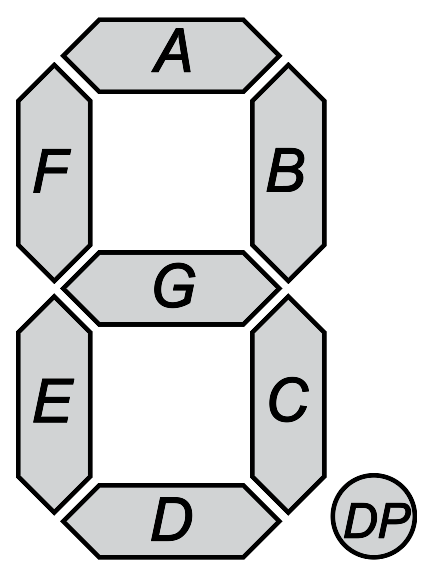

```{r setup, include=FALSE}
knitr::opts_chunk$set(echo = TRUE)
```

I like the wiki page about [seven-segment displays](https://en.wikipedia.org/wiki/Seven-segment_display) and without it I would have not been able do understand the puzzle. 

This image was helpful: 




## Loading data

```{r}
raw_data <- readLines("data/day8")
```


## Part 1

```{r}
library(stringr)

extract_value <- function(x) { 
    stringr::str_extract(x, "\\|[\\s\\S]*") |> 
    substr( 3, nchar(x) )
}

output_value <- extract_value(raw_data)

##data framing it ? 
output_value.df <- stringr::str_split_fixed(output_value, " ", 4)
```

1 -> 2 segments  
4 -> 4 segments  
7 -> 3 segments  
8 -> 7 segments  


```{r}
nchar_ouptut <- nchar(output_value.df)
class(nchar_ouptut)

only_digits <- function(x){
    ifelse(x  %in% c(2,4,3,7)
           , 1 
           , 0)
}

sum(only_digits(nchar_ouptut))

```

## Part 2

```{r}
extract_signal <- function(x) { 
    
    stringr::str_extract(x, ".+?(?=\\|)") |> 
    trimws()
}

signal_value <- extract_signal(raw_data)

signal_value.df <- stringr::str_split_fixed(signal_value, " ", 10)

signal_value.df[1,]
```

We will do it slowly ... with the example :

```{r}
small_example <- c("ab" # 1
            ,"dab" # 7
            ,"eafb" # 4
            ,"acedgfb" # 8 
            , "cdfbe" 
            , "gcdfa" 
            , "fbcad" # -> 3
            , "cefabd" # -> 9
            , "cdfgeb" # -> 6
            , "cagedb" 
            )
```


Lets do a function that take the 10 signals and produce A, B, C, D, E, F (FF for r), G segments.

```{r}
# We have the all 10 number in the signal and some segment are more present than other. C, E, G are present 9, 4 # and 6 times but A|D 7 times and B|F 8 times.
produce_segment <- function(signal) {
signal <- stringr::str_split_fixed(signal, " ", 10) # comment for small_example
vector_all <- unlist(strsplit(signal, split = ""))
bob <- as.data.frame(table(vector_all))   
names(bob) <- c("letters", "nb")

C <- as.character(bob$letters[bob$nb == 9])
E <- as.character(bob$letters[bob$nb == 4])
FF <- as.character(bob$letters[bob$nb == 6])

# 1 only contains 2 segments and we know one:
one <- unlist(strsplit(signal[nchar(signal) == 2], split = ""))
seven <- unlist(strsplit(signal[nchar(signal) == 3], split = ""))
four <-  unlist(strsplit(signal[nchar(signal) == 4], split = ""))

#3 only contains 3 segments and we know 2 (that are in 1):

B <- one[one %in% as.character(bob$letters[bob$nb == 8])]
A <- seven[!seven %in% one]
# Last missing segments are D and F (7 freq), F is only present in 4
G <- four[four %in% as.character(bob$letters[bob$nb == 7])]
D <- as.character(bob$letters[bob$nb == 7])[!(as.character(bob$letters[bob$nb == 7]) %in% G)]
code <- data.frame(code = c("A", "B", "C", "D", "E", "F","G"),
                   valeur = c(A,B,C,D,E,FF,G))
code
}
code <- produce_segment(small_example)
```

Now I need to produce number with segments (some don't need their length are enough) :

```{r}
library(gtools)
gimme_number <- cbind(signal_value, output_value.df)
#names(gimme_number) <- c("signal_value", "n1", "n2", "n3", "n4")

j = 4

for (i in 1:nrow(gimme_number)) {
    if (nchar(gimme_number[,j][i]) == 2)
        {gimme_number[,j][i] <- 1} 
    else if (nchar(gimme_number[,j][i]) == 3)
        {gimme_number[,j][i] <- 7}
    else if (nchar(gimme_number[,j][i]) == 4)
        {gimme_number[,j][i] <- 4}
    else if (nchar(gimme_number[,j][i]) == 7)
        {gimme_number[,j][i] <- 8}
    else if (nchar(gimme_number[,j][i]) == 5)
    {
       code <- produce_segment(gimme_number[,1][i])
       two <- c(code$valeur[code$code == "A"],
                 code$valeur[code$code == "B"],
                 code$valeur[code$code == "G"],
                 code$valeur[code$code == "E"],
                 code$valeur[code$code == "D"])

        five <- c(code$valeur[code$code == "A"],
                 code$valeur[code$code == "F"],
                 code$valeur[code$code == "G"],
                 code$valeur[code$code == "C"],
                 code$valeur[code$code == "D"])

        permut_two <- apply(gtools::permutations(5, 5, two, repeats.allowed = FALSE), 1, paste,  collapse="")
        permut_five <- apply(gtools::permutations(5, 5, five, repeats.allowed = FALSE), 1, paste,  collapse="")
       
       if (gimme_number[,j][i] %in%  permut_two){
           gimme_number[,j][i] <- 2
        } else if (gimme_number[,j][i] %in% permut_five){ 
            gimme_number[,j][i] <- 5
                } else {gimme_number[,j][i] <- 3}
    }
    else if (nchar(gimme_number[,j][i]) == 6) {
        
       code <- produce_segment(gimme_number[,1][i])
       segment <- unlist(strsplit(gimme_number[,j][i], split = " "))
       six_seq <-segment[nchar(segment) == 6]
       six  <- c(code$valeur[code$code == "A"],
                 code$valeur[code$code == "F"],
                 code$valeur[code$code == "G"],
                 code$valeur[code$code == "E"],
                 code$valeur[code$code == "D"],
                 code$valeur[code$code == "C"])

        zero <- c(code$valeur[code$code == "A"],
                 code$valeur[code$code == "B"],
                 code$valeur[code$code == "C"],
                 code$valeur[code$code == "D"],
                 code$valeur[code$code == "E"],
                 code$valeur[code$code == "F"])

        permut_six <- apply(gtools::permutations(6, 6, six, repeats.allowed = FALSE), 1, paste,  collapse="")
        permut_zero <- apply(gtools::permutations(6, 6, zero, repeats.allowed = FALSE), 1, paste,  collapse="")
       
       if (gimme_number[,j][i]  %in% permut_six) 
           {gimme_number[,j][i] <- 6}
        else if (gimme_number[,j][i]  %in% permut_zero) 
            {gimme_number[,j][i] <- 0}
                else {gimme_number[,j][i] <- 9}
        
        
    } else  {gimme_number[,j][i] <- gimme_number[,j][i]}
      
        
}

just_number <- gimme_number[,2:5] 

sum(as.integer(apply(just_number, 1, paste,  collapse="")))

```


